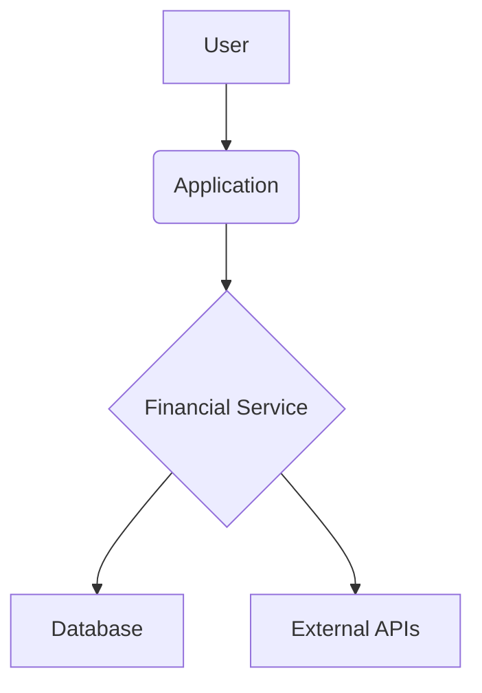

# Java Financial Management System


[](https://www.java.com/)
[](https://maven.apache.org/)
[](https://spring.io/projects/spring-boot)

This Java-based personal finance management tool helps users keep track of their spending, set budgets, and manage their finances. With a user-friendly interface, users can input their income and expenses, categorize them, set financial goals, and receive alerts when they approach or exceed their budget or need to make a payment. The tool also provides helpful visualizations, such as graphs and charts, to help users understand their spending patterns and make informed financial decisions.

## Features

*   **Income and expense tracking**: Users can input their income and expenses and categorize them for better tracking and analysis.
*   **Budgeting**: Users can set a budget for each category of expenses and track their spending against it.
*   **Financial goals**: Users can set financial goals, such as saving for a down payment on a house, and track their progress towards those goals.
*   **Spending analysis**: The tool provides helpful visualizations, such as graphs and charts, to help users understand their spending patterns and make informed financial decisions.
*   **Alerts**: The tool sends alerts to users when they approach or exceed their budget or when they need to make a payment.
*   **Reports**: The tool generates reports to help users stay on track with their finances, such as a monthly spending report or a report on progress towards financial goals.
*   **Multi-currency support**: The tool supports multiple currencies for users who travel or have international financial transactions.
*   **Import/Export**: The tool can import transactions from bank or credit card statements, and allows users to export their data for use in other financial software.
*   **Mobile compatibility**: The tool has a mobile-friendly interface for users who want to access their financial information on-the-go.

## Architecture Diagram

Here's a high-level overview of the system architecture:




## System Requirements

*   Java 11 or higher
*   Apache Maven 3.x
*   Any operating system that supports Java

## How to Use

1.  Clone the repository:

    ```bash
    git clone https://github.com/GabrielDemetriosLafis/Java-Financial-Management-System.git
    cd Java-Financial-Management-System
    ```

2.  Build the project using Maven:

    ```bash
    mvn clean install
    ```

3.  Run the application:

    ```bash
    java -jar target/finance-management-tool-0.0.1-SNAPSHOT.jar
    ```

    *Note: The application might require additional configuration (e.g., database setup) depending on its implementation. Refer to the `config` directory for more details.*

## Contributing

Contributions are welcome! Please feel free to fork the repository, make your changes, and submit a pull request. For major changes, please open an issue first to discuss what you would like to change.

## License

This project is licensed under the MIT License - see the [LICENSE](LICENSE) file for details.

## Author

**Gabriel Demetrios Lafis**

*   [GitHub Profile](https://github.com/GabrielDemetriosLafis)
*   [LinkedIn Profile](https://www.linkedin.com/in/gabriel-demetrios-lafis/)

