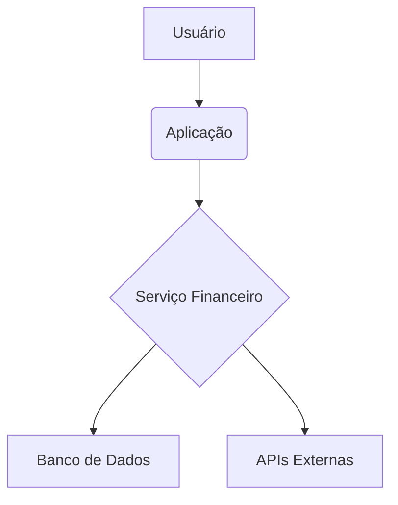

# Sistema de Gerenciamento Financeiro em Java


[](https://www.java.com/)
[](https://maven.apache.org/)
[](https://spring.io/projects/spring-boot)

Esta ferramenta de gerenciamento financeiro pessoal baseada em Java ajuda os usuários a acompanhar seus gastos, definir orçamentos e gerenciar suas finanças. Com uma interface amigável, os usuários podem inserir suas receitas e despesas, categorizá-las, definir metas financeiras e receber alertas quando se aproximam ou excedem seu orçamento ou precisam fazer um pagamento. A ferramenta também fornece visualizações úteis, como gráficos, para ajudar os usuários a entender seus padrões de gastos e tomar decisões financeiras informadas.

## Funcionalidades

*   **Rastreamento de receitas e despesas**: Os usuários podem inserir suas receitas e despesas e categorizá-las para melhor acompanhamento e análise.
*   **Orçamento**: Os usuários podem definir um orçamento para cada categoria de despesas e acompanhar seus gastos em relação a ele.
*   **Metas financeiras**: Os usuários podem definir metas financeiras, como economizar para a entrada de uma casa, e acompanhar seu progresso em relação a essas metas.
*   **Análise de gastos**: A ferramenta fornece visualizações úteis, como gráficos, para ajudar os usuários a entender seus padrões de gastos e tomar decisões financeiras informadas.
*   **Alertas**: A ferramenta envia alertas aos usuários quando eles se aproximam ou excedem seu orçamento ou quando precisam fazer um pagamento.
*   **Relatórios**: A ferramenta gera relatórios para ajudar os usuários a manter o controle de suas finanças, como um relatório de gastos mensais ou um relatório de progresso em relação às metas financeiras.
*   **Suporte a múltiplas moedas**: A ferramenta suporta múltiplas moedas para usuários que viajam ou têm transações financeiras internacionais.
*   **Importação/Exportação**: A ferramenta pode importar transações de extratos bancários ou de cartão de crédito e permite que os usuários exportem seus dados para uso em outros softwares financeiros.
*   **Compatibilidade móvel**: A ferramenta possui uma interface amigável para dispositivos móveis para usuários que desejam acessar suas informações financeiras em trânsito.

## Diagrama de Arquitetura

Aqui está uma visão geral da arquitetura do sistema:




## Requisitos do Sistema

*   Java 11 ou superior
*   Apache Maven 3.x
*   Qualquer sistema operacional que suporte Java

## Como Usar

1.  Clone o repositório:

    ```bash
    git clone https://github.com/GabrielDemetriosLafis/Java-Financial-Management-System.git
    cd Java-Financial-Management-System
    ```

2.  Compile o projeto usando Maven:

    ```bash
    mvn clean install
    ```

3.  Execute a aplicação:

    ```bash
    java -jar target/finance-management-tool-0.0.1-SNAPSHOT.jar
    ```

    *Nota: A aplicação pode exigir configuração adicional (por exemplo, configuração de banco de dados) dependendo de sua implementação. Consulte o diretório `config` para mais detalhes.*

## Contribuição

Contribuições são bem-vindas! Sinta-se à vontade para fazer um fork do repositório, fazer suas alterações e enviar um pull request. Para grandes alterações, por favor, abra uma issue primeiro para discutir o que você gostaria de mudar.

## Licença

Este projeto está licenciado sob a Licença MIT - veja o arquivo [LICENSE](LICENSE) para detalhes.

## Autor

**Gabriel Demetrios Lafis**

*   [Perfil GitHub](https://github.com/GabrielDemetriosLafis)
*   [Perfil LinkedIn](https://www.linkedin.com/in/gabriel-demetrios-lafis/)

